# BridgeAgent

基于多模态大模型与知识检索的桥梁智能建模平台。

本项目是本机部署的桥梁建模工作台。只需要提供桥梁图纸，就能自动调用大模型进行识图、建模、分析作业，并将详细信息展示在工作台账本中，属于多人协同的工程项目工作台。并且搭载了RAG知识库管理、人员权限控制、项目信息问询回答等多种功能。在本机 **SAP2000** 里得到可打开的梁式桥有限元模型，供后续抗震分析使用。

目前还是第一版，**只针对梁式桥，只联通SAP2000有限元软件**。反应谱、时程等计算本阶段不做——软件目前「模型建好」。后续会继续加入分析，并自动根据静力、反应谱、时程等分析结果校准有限元模型，实现项目闭环。

## 项目亮点

**识图—建模—分析全流程智能作业。** 面向抗震有限元闭环设计：视觉模型抽取竣工图几何，账本驱动本机 SAP2000 生成可打开的 `.sdb`；分析与依据结果校准模型为后续阶段，当前版本交付停在「模型建好」。

**企业级知识库管理。** 规范与手册进入公司总库，完成解析、切分与向量化；以项目启用集划定检索范围，问询与建模按需检索，避免将整本规范灌入上下文。

**长短期记忆分层架构。** 短期记忆记录工种过程与问询会话，长期记忆保留项目级索引；结构尺寸以账本为唯一事实源，Agent 仅通过只读投影访问，参数不写入对话记忆。

**账本信息弹性化。** 固定结构字段与可扩展参数袋并存，识图结果按字段语义路由入列或入袋；缺项可补充识别或人工修订，与已有数据冲突时须确认后写入。

**多模态图纸理解。** 视觉大模型对图册分页分类，抽取跨径、墩高、截面等关键尺寸，与人工修订共用同一份结构账本。

**权限治理与任务编排。** 系统角色与项目级授权分离，识图、知识作业与建模排队执行；高风险动作经任务确认后落地，并支持操作审计。

## 项目总述

抗震分析要的不是一张聊天记录，而是截面、跨径、墩高、支座和边界清楚的计算模型。这些数通常散在扫描图册和规范条文里。过去要对着图在 SAP2000 里一根梁、一根柱地建，既慢也容易漏。

**BridgeAgent 管的是「从图纸到模型」这一段。** 工作按**项目**展开：一座桥、一幅桥面一份账本。图册交给系统后，视觉大模型识图写入尺寸；项目组把规范放进知识库，平台拆文、切条、做成可检索的资料；有权限的人同意任务后，按账本在本机 SAP2000 出 `.sdb`。问询用来查数、查规范、补任务卡，不能绕过确认直接改模型。

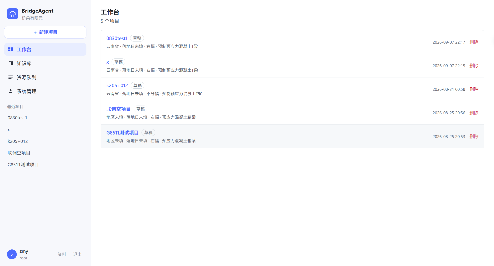

### 你要准备什么

- **竣工图 PDF**（本步识 PDF，不识 DWG/DXF）。
- 本机已授权的 **SAP2000**（要出模型时）。
- 可选：规范等 PDF，放进公司知识库后，按项目勾选启用。

人主要做三件事：把文件放进来、在概览里核对账本、对任务卡点同意。不必从零填写每一联跨径和每一根墩高。

### 你得到什么

- 项目账本里的结构尺寸（跨径联、墩柱、材料等），识图与手改都落在同一份事实上。
- 可下载的 SAP2000 模型版本，同一座桥可以留多版。
- 带权限的工作台：多座桥并列，识图、建模、知识作业排队可见，同事按角色各干各的。

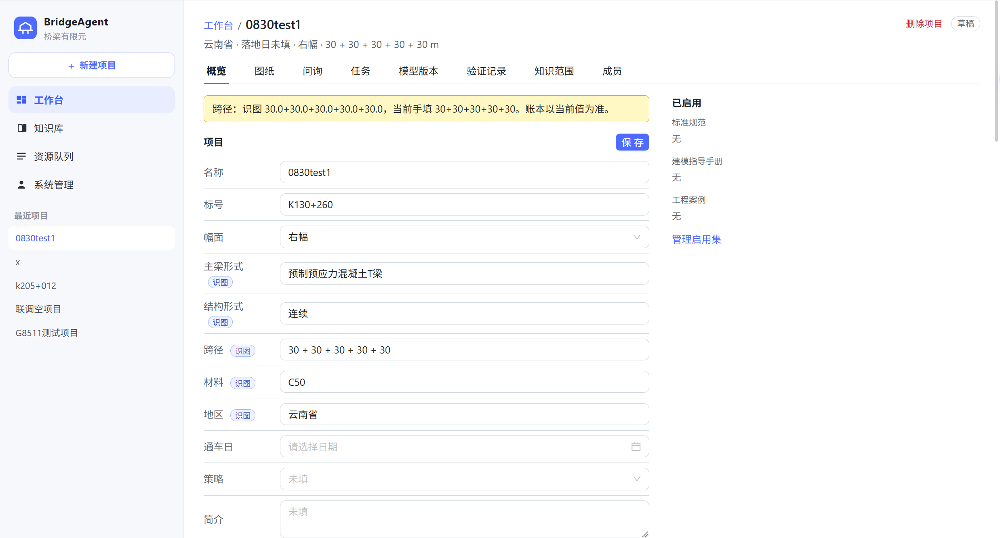

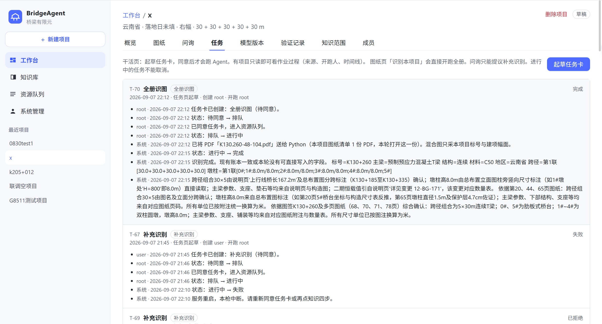

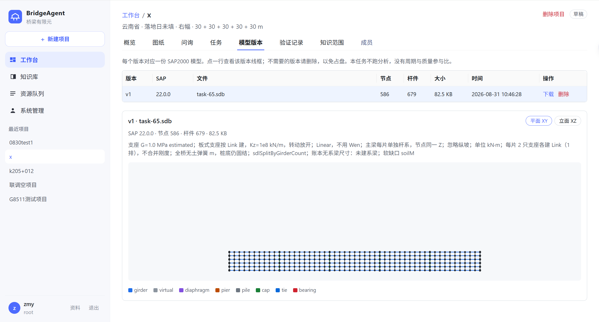

### 三件事，第一次用就能对上号

**1. 从图纸到 SAP 模型**  
上传图册，系统用百炼视觉大模型分页看图、抽取尺寸，写入账本；缺硬条件会自动要求补识。账本齐了、人同意建模后，按账本在本机 SAP2000 建梁式桥模型。你省下的是对着总布置图逐项填 SAP 的时间；你仍要看一眼账本对不对——对不上已有数时，系统会停下来问，不会默默覆盖。

**2. 多座桥、多个人、同一套台子**  
工作台列出全部可见项目。角色分开：超管、知识库管理员、项目管理员、操作员、只读。项目里再分「只看」和「能改、能开跑」。同一座桥上，识图和建模同时只推进一条干活链，避免两个人一起改模型；问询可以同时进行。本机三条作业车道（识图 / 知识解析 / 建模）谁在跑、谁在排，侧栏能看见。同一账号同时只允许一处登录。

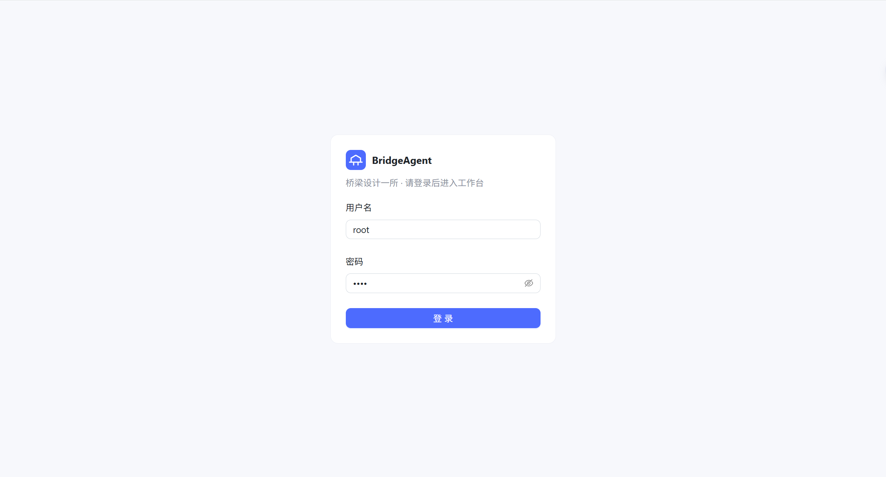

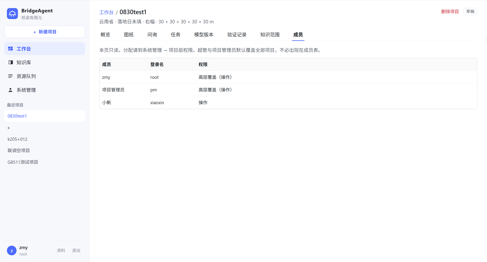

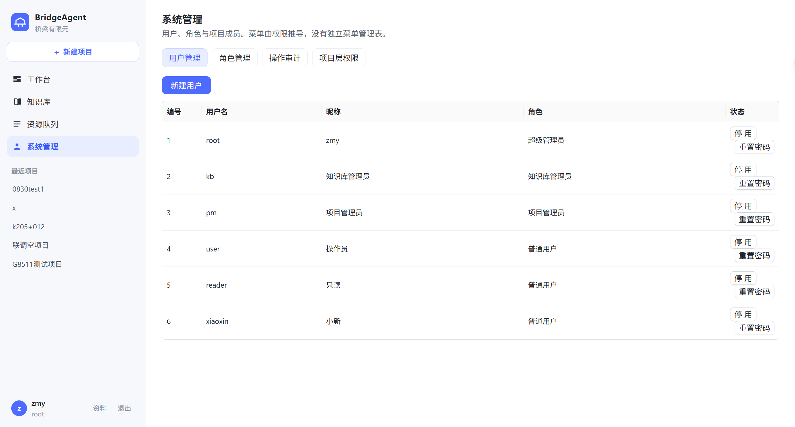

**3. 项目组自己的知识库，上传后由平台拆解**  
规范、手册等 PDF 进公司总库。正文、表、图由 **Unstructured** 解析，附图再经大模型识别；过长条文会切开并写入本机向量库。每个项目勾选启用哪些文献，问询和建模只在启用范围内检索，不是把全书一次性塞进对话。

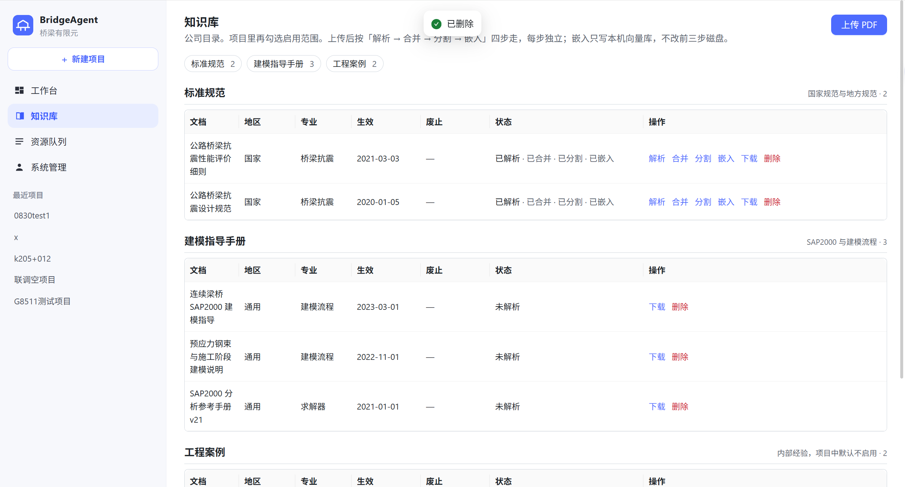

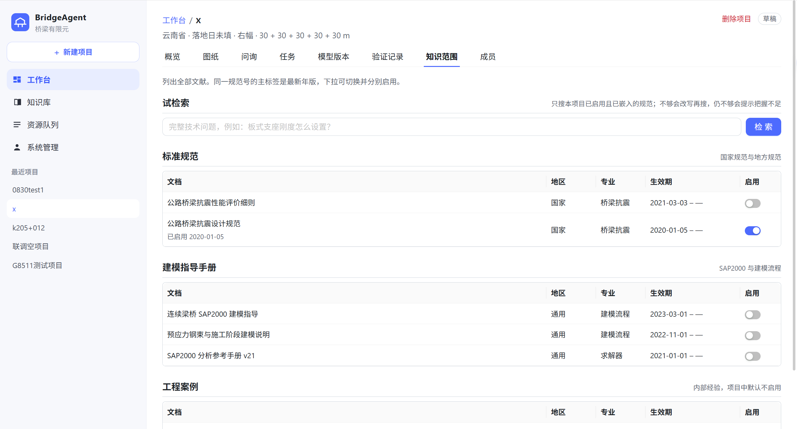

图纸、规范 PDF 和 `.sdb` 留在本机磁盘。浏览器只连本机前端，不是公网代算。

规划与接口：[docs/roadmap.md](docs/roadmap.md)。许可证 [MIT](LICENSE)。密钥 [SECURITY.md](SECURITY.md)。

## 功能说明

**识图。** 默认模型 `qwen3-vl-plus`。先给页面分类，再抽说明、总布置、墩柱等页上的尺寸。CAD 本步不识。规范整本不走识图管线。

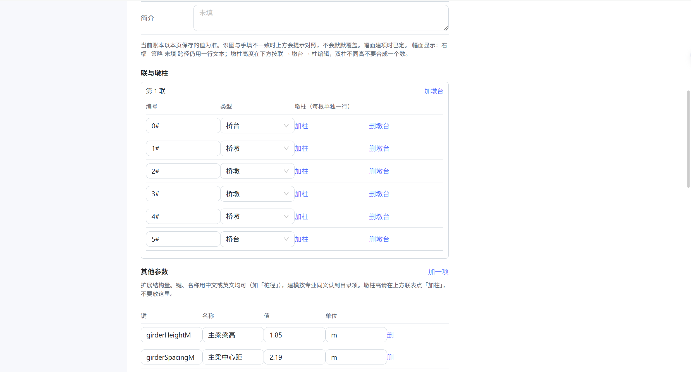

**建模。** 同意建模任务后先检查账本；硬缺口自动插补充识别，补上再继续。通过后经 SAP2000 COM 建模型并登记版本。没有本机 SAP 则无法出 `.sdb`。

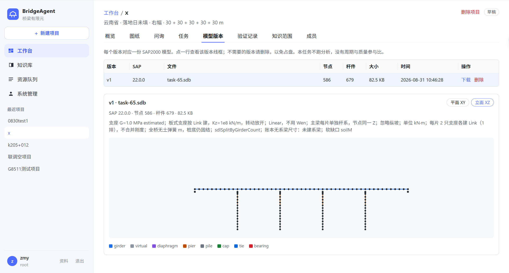

**问询。** 问尺寸、规范限值、还缺哪类图。以账本为准，需要时检索已启用规范。要开识图或建模必须出任务卡，有操作权的人同意后才执行。各人问询私有。

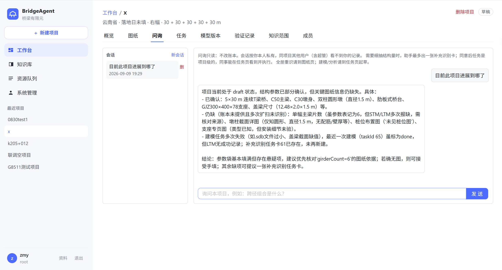

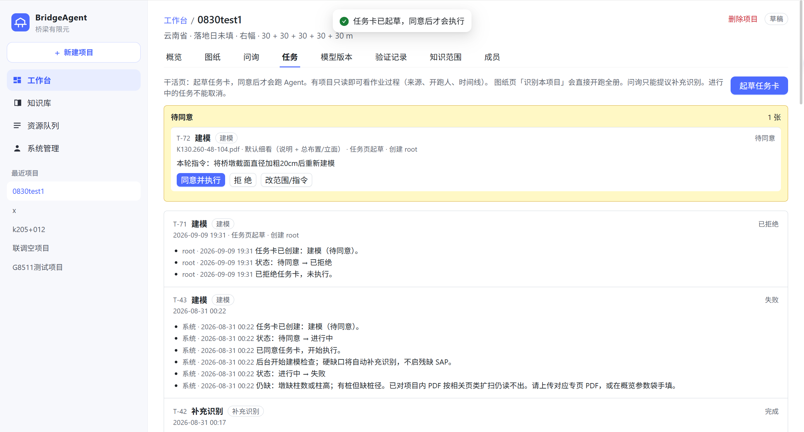

**作业调度。** 识图、知识四步、建模分三条车道排队。超管可看操作审计。

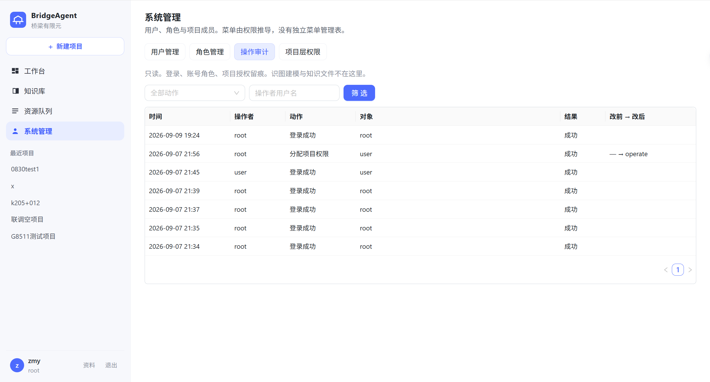

**和「什么都往对话框里扔」的差别。** 入口是项目里的任务卡。建议顺序：建项 → 传图 → 同意识图 → 核对账本 → 问询或手改 → 同意建模 → 下载 `.sdb`。

```text
浏览器  →  Spring（账本、权限、任务）  →  Python（识图 / 问询 / 检索 / 建模检查）
                                        ├ 百炼（看图、条文、向量）
                                        ├ Unstructured（规范 PDF）
                                        └ 本机 SAP2000（.sdb）
```

## 如何启动

日常要同时开 **三个程序**，外加本机已经在跑的 MySQL。知识库嵌入还要本机 Milvus；建模还要本机 SAP2000。三个程序各占一个窗口，关掉哪个窗口，哪一边就停。


| 开什么                     | 点哪里 / 跑哪个文件                                                        | 起来之后                 |
| ----------------------- | ------------------------------------------------------------------ | -------------------- |
| 后端（账本和接口）               | 在 `bridge_agent_demo` 目录执行下面的 Maven 命令，入口是里面的 Spring 工程（`pom.xml`） | 本机 `8080`            |
| Python（识图、问询、知识作业、建模检查） | 在 `python_agent` 目录运行 `**app.py**`                                 | 本机 `8001`            |
| 前端（浏览器界面）               | 资源管理器里双击仓库根目录的 `**启动前端.bat**`                                      | 本机 `5173`，一般会自动打开浏览器 |


先起 MySQL，再起后端和 Python，最后点 `启动前端.bat`。用浏览器打开 **[http://127.0.0.1:5173](http://127.0.0.1:5173)**（若脚本已打开可不管）。登录页用下面的演示账号。不要去浏览器里开 8080 或 8001。

不要把 `data/` 里的图纸和规范 PDF 提交到 Git。

### 第一次用之前（只做一遍）

本机需要：JDK 21、Maven、Python 3.12、Node.js、MySQL 8。识图要百炼 Key；解析规范要 Unstructured Key；建模要已授权的 SAP2000（仓库不含安装包）。

1. 复制 `python_agent/.env.example` 为 `**python_agent/.env**`，填入 `DASHSCOPE_API_KEY=`（解析规范再填 `UNSTRUCTURED_API_KEY=`）。这个文件不要提交、不要发到网上。
2. 复制 `bridge_agent_demo/src/main/resources/application-local.properties.example` 为同目录的 `**application-local.properties**`，填 MySQL 密码和至少 32 位的 JWT 密钥。缺这一步 Spring 起不来。
3. 用 MySQL 执行 `**bridge_agent_demo/src/main/resources/db/schema.sql**` 建库 `bridge_agent`。已经有旧库的，按 `docs/roadmap.md`「怎么跑」里的补丁接着跑。
4. 知识嵌入需要本机 Milvus（默认端口 `19530`），用得到再开。

### 三个窗口分别怎么开

**窗口 1 — 后端**（在 `bridge_agent_demo` 里，认的是这个目录的 `pom.xml`）：

```text
cd bridge_agent_demo
mvn -DskipTests spring-boot:run
```

看到应用启动完成、端口 8080 即可。不要关这个窗口。

**窗口 2 — Python**（跑的就是 `**python_agent/app.py`**）：

```text
cd python_agent
py -3.12 -m venv .venv
.\.venv\Scripts\python -m pip install -r requirements.txt
.\.venv\Scripts\python app.py
```

虚拟环境建过、依赖装过，以后每次只要最后一行 `app.py`。窗口里出现监听 `8001` 即可。

**窗口 3 — 前端：** 到仓库根目录（和 `README.md` 同一层）**双击 `启动前端.bat`**。第一次会 `npm install`，然后启动 Vite，并尝试打开 [http://127.0.0.1:5173/workbench](http://127.0.0.1:5173/workbench) 。关掉这个黑窗口，前端就停了。

若不想用脚本，等价命令是进入 `web` 后执行 `npm install`（首次）和 `npm run dev`。

**局域网（可选）：** 默认前端只给本机用。同事要访问时，把 `web/vite.config.ts` 里 `server.host` 改成 `true`，防火墙放行 5173，用这台电脑的局域网 IP 打开 5173，不要把 8080、8001 暴露出去。

## 演示账号

种子密码均为 `**1234**`，仅供本机。用户名不区分大小写。不要用于公网。


| 登录名      | 昵称     | 角色            | 能做什么                                     |
| -------- | ------ | ------------- | ---------------------------------------- |
| `root`   | zmy    | 超级管理员 `admin` | 系统管理、知识总库写、全部项目操作                        |
| `kb`     | 知识库管理员 | `knowledge`   | 知识总库上传/四步；无项目管理员权                        |
| `pm`     | 项目管理员  | `project`     | 全部项目操作与建删项；知识库只读                         |
| `user`   | 操作员    | `user`        | 仅成员表里的项目；种子为项目 `id=11` 的 **operate**     |
| `reader` | 只读     | `user`        | 种子为项目 `id=11` 的 **read**（可问询/看任务，不能同意开跑） |


超管 / 项目管理员不写 `sys_project_member`。普通用户的项目层权限为 `read` 或 `operate`。一人一角色；同一账号同时只允许一处登录。

## 仓库里有什么、不要提交什么

- 提交：源码、`docs/`（含 `docs/screenshots/`）、`.cursor/rules`、空的 `.env.example` 与 `application-local.properties.example`。
- 不要提交：`.env`、`application-local.properties`、`data/`、`node_modules`、`.venv`、`target/`。

